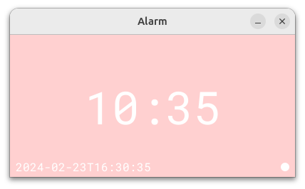

# Simple alarm application with kotlin

Yet another single-file alarm program coded in Kotlin.
- Left click anywhere to turn on/off
- Use mouse wheel the adjust when to trigger the alarm

Screenshot:<br>


```shell
$ kotlinc -version
info: kotlinc-jvm 1.9.22 (JRE 21.0.2+13-LTS-jvmci-23.1-b30)

$ make --version
GNU Make 4.3
Built for x86_64-pc-linux-gnu
Copyright (C) 1988-2020 Free Software Foundation, Inc.
License GPLv3+: GNU GPL version 3 or later <http://gnu.org/licenses/gpl.html>
This is free software: you are free to change and redistribute it.
There is NO WARRANTY, to the extent permitted by law.
```
